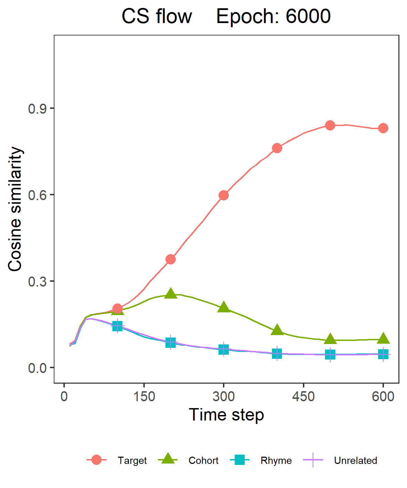
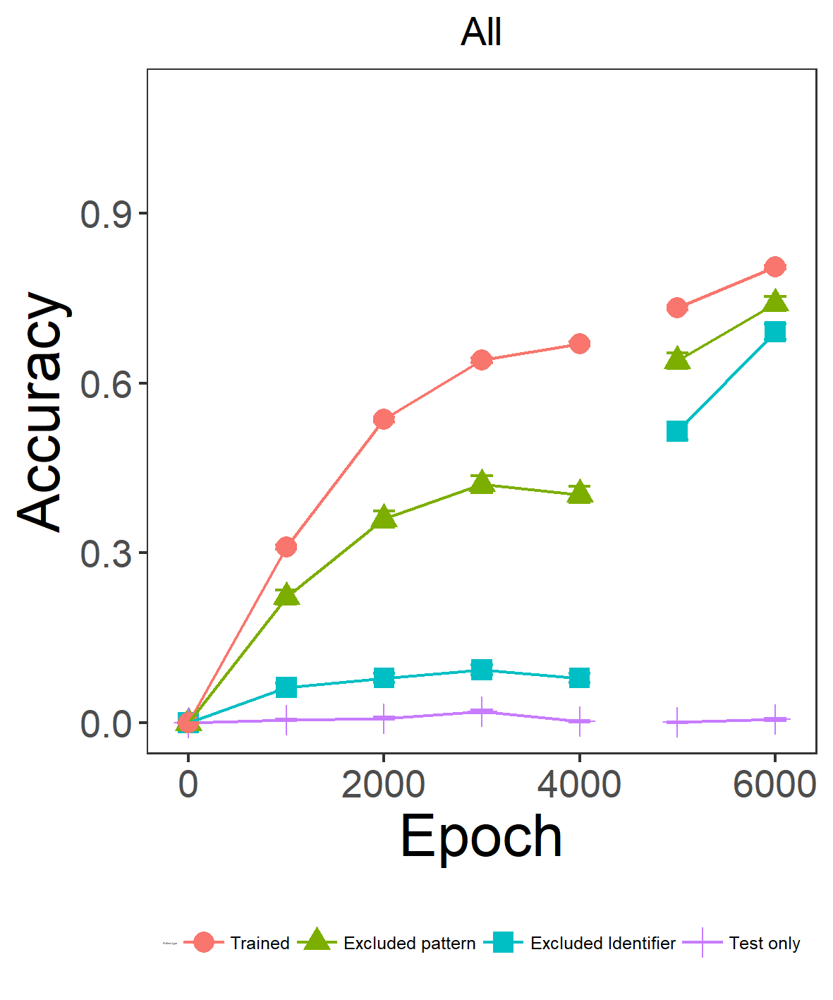
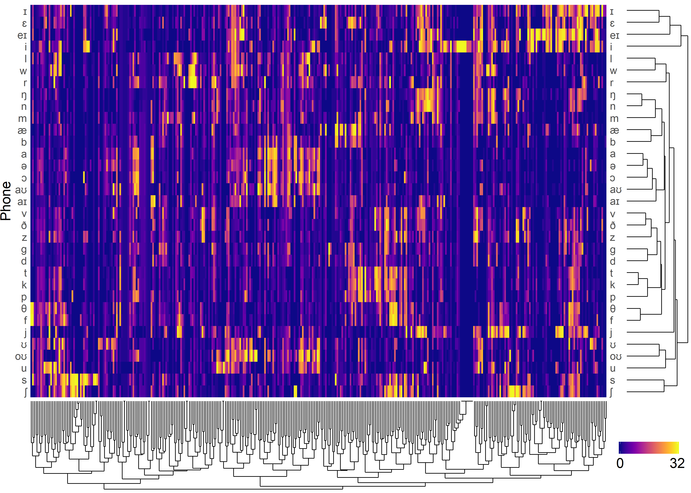
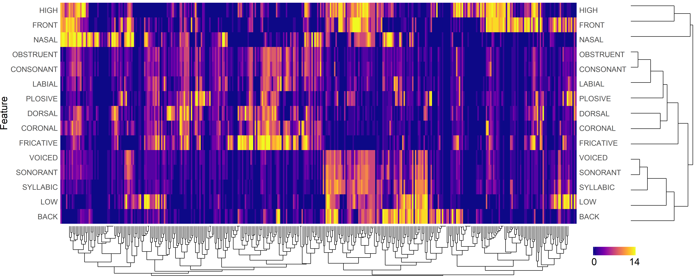
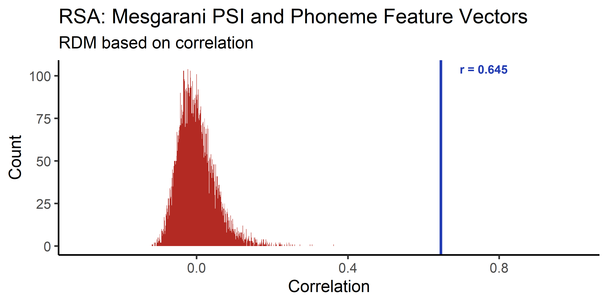
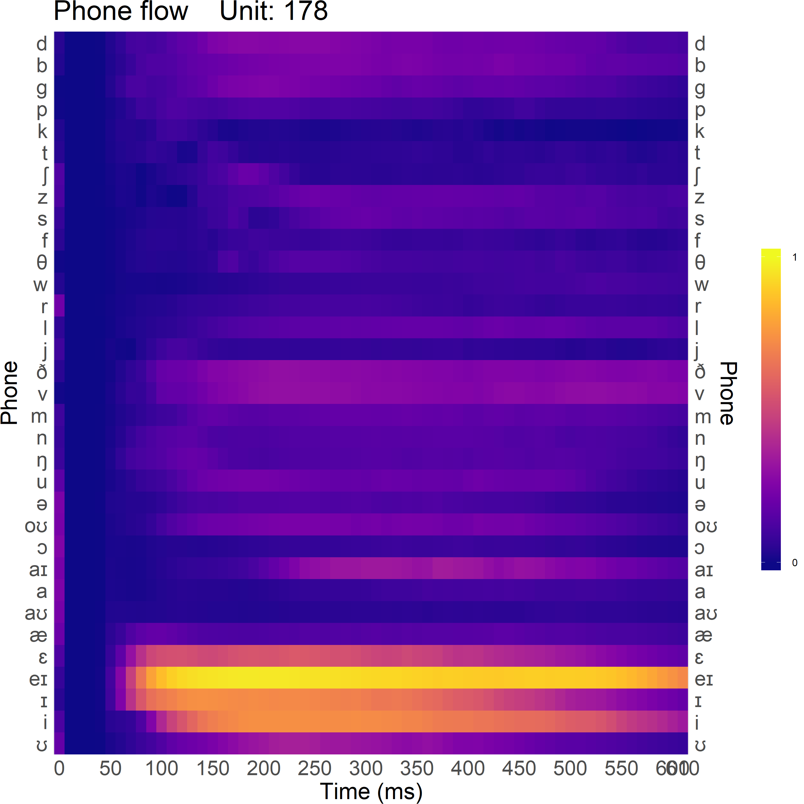

# EARShot_TF2

The EARShot model on Tensorflow 2

* TensorFlow 1 version link:
    * https://github.com/maglab-uconn/EARSHOT
    * https://github.com/maglab-uconn/EARSHOT_N

## Paper

Magnuson, J.S., You, H., Luthra, S., Li, M., Nam, H., Escabí, M., Brown, K., Allopenna, P.D., Theodore, R.M., Monto, N., & Rueckl, J.G. (2020). EARSHOT: A minimal neural network model of incremental human speech recognition. Cognitive Science, 44, e12823. http://dx.doi.org/10.1111/cogs.12823 -- 
[PDF](https://magnuson.psy.uconn.edu/wp-content/uploads/sites/1140/2020/04/EARSHOT_cogsci_2020.pdf) -- 
[Supplmentary materials](https://magnuson.psy.uconn.edu/wp-content/uploads/sites/1140/2020/04/earshot_CS_brief_report_REV_2020.04.10_supp.pdf)


## Requiremet

* Tensorflow >=2.2.0rc4
* Librosa >= 0.7.0
* FFMPEG

## Structure


## Dataset

### Wavfiles for acoustic pattern

* This Data is generated by the Says of Mac [here](https://drive.google.com/drive/folders/1S09iHmKoX5cGZb3gUWmg2J2ErbstG2tY?usp=sharing)    

* Download diphone wav files for hidden analysis [here](https://drive.google.com/file/d/1poWuCQ1_09jBSaIZJbj5KvBLl4HejdH3/view)

## Hyper parameters

* Pattern
    * Lexicon_File
        * List of words to use
        * Please see the example: 'ELP_groupData.csv'
    * Wav_Path
        * The path of wav files for generating dataset
    * Pattern_Path
        * The path of generated dataset
    * Metadata_File        
        * The metadata file name.
        * Default is 'METADATA.PICKLE'
        
    * Acoutsic
        * Mode
            * Determine which type of acoustic pattern use.
            * 'Spectrogram' or 'Mel'
        * Spectrogram
            * This parameters are used only `Mode` == `Spectrogram`
            * Sample_Rate            
            * Dimension
            * Frame_Length
            * Frame_Shift 
        * Mel
            * This parameters are used only `Mode` == `Mel`
                * Sample_Rate
                * Spectrogram_Dim
                * Mel_Dim
                * Frame_Length
                * Frame_Shift
                * Max_Abs
                    * If a positive float, pattern is symetric `-Max_Abs` to `Max_Abs`
                    * If 'null', non symmetric '0 to 1'.
        
        
    * Semantic
        * Mode
            * Determine which type of semantic pattern use.
            * 'SRV' or 'PGD'
        * SRV
            * This parameters are used only `Semantic_Mode` == `SRV`
            * Size
                * Determine the size of pattern
            * Assign_Number
                * Determine How many units have 1. Other units have 0.    
        * PGD
            * This parameters are used only `Semantic_Mode` == `PGD`
            * Size
                * Determine the size of pattern
            * Dict_File_Path
                * The path of __`pre generated dict`__ pickle file.

* Hidden_Analysis
    * Diphone_Wav_Path
        * diphone wav directory to be used for hidden analysis
        * This parameter is required.
        * Ex. `./Diphone_Wav`
    * Phoneme_Feature
        * Phones to be used during hidden analysis and feature information of each phone
    * Sensitive_Index
        * Criteria
            * In PSI and FSI, threshould criteria range
        * Step range
            * In PSI and FSI, Time range to be included in the calculation of average activation value
    * Only_All
        * When `true`, only the flow, PSI, and FSI based on all identifier mean are calculated.


* Model
    * Prenet_Conv
        * Channels, Kernel sizes, and strides must be lists of the same size.
        * Use
            * If `true`, model uses prenet.
            * If `false`, the sub-parameters of 'Prenet_Conv' will be ignored.
        * Channels
            * Determine the number of filters in each convolution.
            * Ex: [512, 512, 512]
        * Kernel_Sizes
            * Determine the kernel size for each convolution.
            * Ex: [5, 5, 5],
        * Strides
            * Determine the stride size for each convolution.
            * Changing this value affects the number of time steps.
            * Ex: [1, 1, 1]
        * Use_Batch_Normalization
            * If true, model applies batch normalization after convolution.
        * Dropout_Rate
            * Determine a dropout rate during training.
            * *If 'None', there is no dropout.
        }),

    * Hidden
        * Type
            * Determine which type of RNN use.
            * 'LSTM', 'GRU', 'BPTT'
        * Size
            * Determine RNN cell's size
        * No_Reset_State
            * When `true`, initial hidden state of each training is the last hidden state of previous training.
            * When `false`, initial hidden state of each training is a zero vector.

 * Train
    * Use_Pattern_Cache
        * When `true`, trained patterns are stored in memory, the next pattern generate can proceed quickly.
        * This setting improves speed, but if the pattern is stored on an SSD, the effect may not be significant.
        * An error may occur when the number of patterns being learned is excessively greater than the simulation's permissible environment
    * Batch_Size
        * Determine the batch size during learning.
        * When Out of memory occurs, decrease according to the environment(GPU memory).
    * Learning_Rate
        * Use_Noam
            * When `true`, noam decay is applied to learning rate.
            * When `false`, learning rate is fixed to initial value.
        * Initial
            * Determine the initial learning rate.
            * A positive float is required.
        * Warmup_Step
            * Determin the warm-up step of noam decay
            * Only used when `Use_Noam` is `true`.
        * Min
            * Determine the minium learning rate.
            * A positive float is required.
    * ADAM
        * Set ADAM optimizer parameters.
    * Test_Only_Identifier_List
        * Determines which talkers are always excluded regardless of the exclusion mode.
        * If nothing, `[]`
        * Ex: ['EO', 'JM'] or `[]`
    * Max_Epoch_with_Exclusion
        * Apply 'Exclusion_Mode' and learn to set epoch.
    * Max_Epoch_without_Exclusion
        * From 'Max_Epoch_with_Exclusion' to the set epoch, 'Exclusion_Mode' is ignored and learned.
        * This is the parameter used to over-training all patterns after normal training.        
        * This parameter must bigger than 'Max_Epoch_with_Exclusion'.
    * Max_Queue
        * Determines the maximum size of queue saving the next training pattern
    * Exclusion_Mode
        * Set pattern exclusion method. You can choose between P (pattern based), T (talker based), or M (mix based).
        * If set to P, 1/10 of each talker pattern will not be trained.
        * When set to T, all patterns of one talker are excluded from the learning. The talker can be set via the 'et' parameter.
        * When set to M, patterns are excluded as a mixture of the two methods.
        * When set to None, all patterns will be learned.
    * Checkpoint_Timing
        * Determine the frequency of the checkpoint saving during learning
        * A positive integer is required.
    * Test_Timing
        * Determine the frequency of the inference during learning.
        * A positive integer is required.
    
* Result_Path
    * Determine result and checkpoint save path
* Device
    * Determine which GPU is used.
    * When `-1`, CPU only model is turned on.

## Pattern generate
### Command
```
python Pattern_Generator.py
```

* In some cases, you may want to construct a subset using only specific words or specific identifiers.
* A subset of word or identifier can be formed through the following method.
    1. In `python` or `ipython`, type the following command:
    ```
    from Pattern_Generator import Metadata_Subset_Generate
    ```
    2. Set subset.
    ```
    identifier_List = ["Agnes", "Alex", "Bruce", "Fred", "Junior", "Kathy", "Princess", "Ralph", "Vicki", "Victoria"]    
    ```
    3. Type following command:
    ```
    Metadata_Subset_Generate(
        word_List= None,
        identifier_List= identifier_List,
        metadata_File_Name = 'METADATA.SUBSET.PICKLE'
        )
    ```

    * If all words or identifiers are used, the list is set to `None`.

    4. Modify the `Metadata_File` parameter to subset metdata file name in [Hyper_Parameter.json](./Hyper_Parameters.json)

## Model run
```
python Model.py [parameters]
```
### Parameters

* `-se <int>`
    * Set the model's start epoch. This parameter and the 'mf' parameter must be set when loading a previously learned model.
    * The default value is 0.

* `-ei <talker>`
    * Set which identifier pattern is excluded from the learning.
    * Applies if `Exclusion_Mode` parameter in [Hyper_Parameter.json](./Hyper_Parameters.json) is T or M, otherwise this parameter is ignored.

* `-d <path>`
    * Determine the path of result and checkpoint.
    * The path is generated as a sub directory in the `Result_Path`.

## Result analysis
### Command
```
python Analyzer.py [parameters]
```

### Parameters
* `-d <path>`
    * Results directory to run the analysis on.
    * This parameter is required.

* `-a <float>`
    * Criterion in reaction time calculation of absolute method.
    * The default is 0.7.

* `-r <float>`
    * Criterion in reaction time calculation of relative method.
    * The default is 0.05.

* `-tw <int>`
    * Width criterion in reaction time calculation of time dependent method used in the paper.
    * The default is 10.

* `-th <float>`
    * Height criterion in reaction time calculation of time dependent method used in the paper.
    * The default is 0.05.

### Execution examples

```
python Analyzer.py -d JUNIOR.IDX0
python Analyzer.py -d AGNES.IDX2 -tw 5 -th 0.1
```

## Hidden analysis - Diphone based
### Command

```
python Hidden_Analyzer.py [parameters]
```

### Parameters

* `-d <path>`
    * Results directory to run the analysis on.
    * This parameter is required.

* `-e <int>`
    * The epoch to run the analysis on.
    * This parameter is required.

### Execution examples

```
python Hidden_Analyzer.py -d AGNES.IDX2 -e 8000
```

## RSA analysis

### Command

```
python RSA_Analyzer.py [parameters]
```

* To use RSA analyzer, the phoneme-feature file in hyper parameter must be set to
[Phoneme_Feature.Paper.txt](./Phoneme_Feature.Paper.txt)
* It is to maintain compatiblity with human data (Mesgarani et al. 2013).

### Parameters

* `-d <path>`
    * Results directory to run the analysis on.
    * This parameter is required.

* `-c <float>`
    * Criterion of the PSI and FSI map to be used.

* `-pn <int>`
    * Number of permutation tests
    * The default is 100000.

### Execution examples

```
python RSA_Analyzer.py -d VICKI.IDX2 -c 0.10 -pn 10000
```


## Generate figures by R script

### Accuracy and cosine similarity flow

#### Method

1. Use `./R_Script/Acc_and_CS_Flow(Fig.3).R`

2. Modify the [parameters](./R_Script/Acc_Flow_Integration_by_Talker(Fig.S2.1).R#L116-121)

3. Run. The result will be in `base_Dir`.

#### Result example


### PSI and FSI

#### Method

1. Use `./R_Script/PSI_and_FSI(Fig.4).R`

2. Modify the [parameters](./R_Script/PSI_and_FSI(Fig.4).R#L36-40)

3. Run. The result will be in each talker's hidden analysis directory.

#### Result example



### RSA permutation test

#### Method

1. Use `./R_Script/RSA_Permutation_Test(Fig.5).R`

2. Modify the [parameters](./R_Script/RSA_Permutation_Test(Fig.5).R#L7-10)

3. Run. The result will be in each talker's hidden analysis directory.

#### Result example


### Phoneme and feature flow

#### Method

1. Use `./R_Script/Phoneme_and_Feature_Flow(Fig.6).R`

2. Modify the [parameters](./R_Script/Phoneme_and_Feature_Flow(Fig.6).R#L10-14)

3. Run. The result will be in each talker's hidden analysis directory.

#### Result example


### Accuracy flow integration by talker

This is different 'Accuracy and cosine similarity flow'. This analysis checks the accuracy of the talker's data in all simulations.

#### Method

1. Use `./R_Script/Acc_Flow_Integration_by_Talker(Fig.S2.1).R`

2. Modify the [parameters](./R_Script/Acc_Flow_Integration_by_Talker(Fig.S2.1).R#L53-58)

3. Run. The result will be in `base_Dir`.

#### Result example


### Phoneme and feature flow tile

#### Method

1. Use `./R_Script/Phoneme_and_Feature_Flow_All_Tile(Fig.S2.2-3).R`

2. Modify the [parameters](./R_Script/Phoneme_and_Feature_Flow_All_Tile(Fig.S2.2-3).R#L30-35)

3. Run. The result will be in each talker's hidden analysis directory.

#### Result example


### Phoneme and feature flow compare

#### Method

1. Use `./R_Script/Phoneme_and_Feature_Flow_Compare(Fig.S2.4).R`

2. Modify the [parameters](./R_Script/Phoneme_and_Feature_Flow_Compare(Fig.S2.4).R#L10-16)

3. Run. The result will be in each talker's hidden analysis directory.

#### Result example

